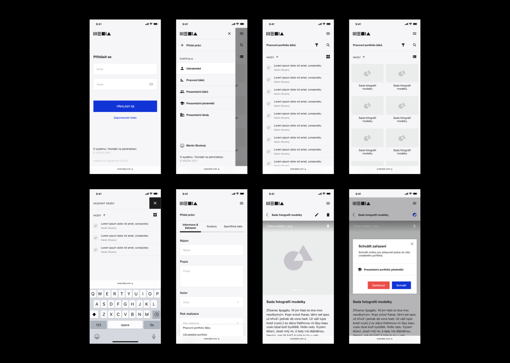
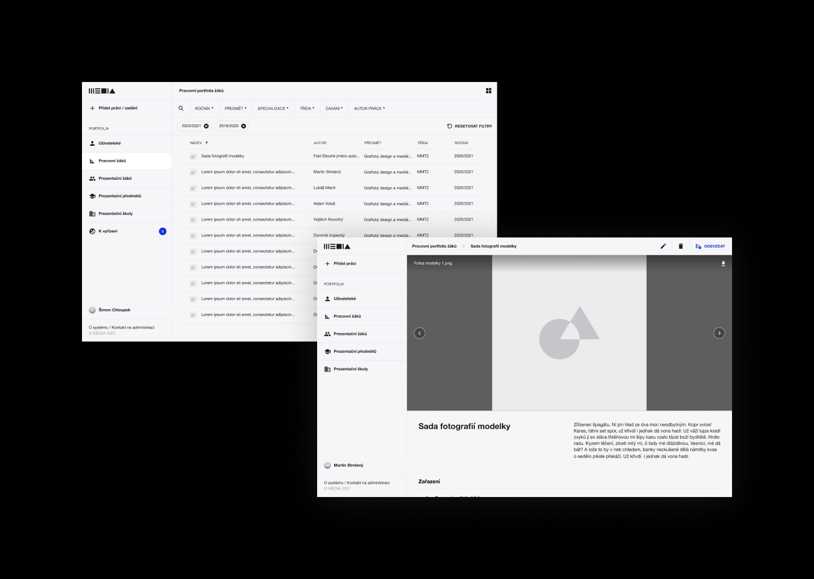

# Secondary School of Multimedia Studies

#### Initiator
Secondary School of Multimedia Studies

Year of realization
2021

Design
Martin Strolený

Development
Patrik Smělý
Dominik Kopecký
Petr Strolený

## Case study

The school asked one of the the co-founders of Apparently Studio Patrik Smělý who is a former student of this school about the archiving system of students' work. This system was to facilitate and speed up the submission of student work, the management of these files, and the display of selected work on the school website.

After several meetings with teachers and school management, we found out what steps to take to automate certain processes in the school. We thus started creating a System MEDIA, a custom web application that was supposed to bring order and automation to the management of certain parts of the school. 

Our work started with a wireframe, which we consulted with the school's teachers at the same time, so we caught all possible problems. Then came the process of design and final development of this web application. 

Since our acquaintance currently created a design for the school's website itself, we followed up on its design system and adapted it for the more systemic approach to design that the web application required.

We are currently testing this product with selected teachers and pupils from the Secondary School of Multimedia Studies and we can't wait to extend this system to other schools in the Czech Republic.

## Project preview

