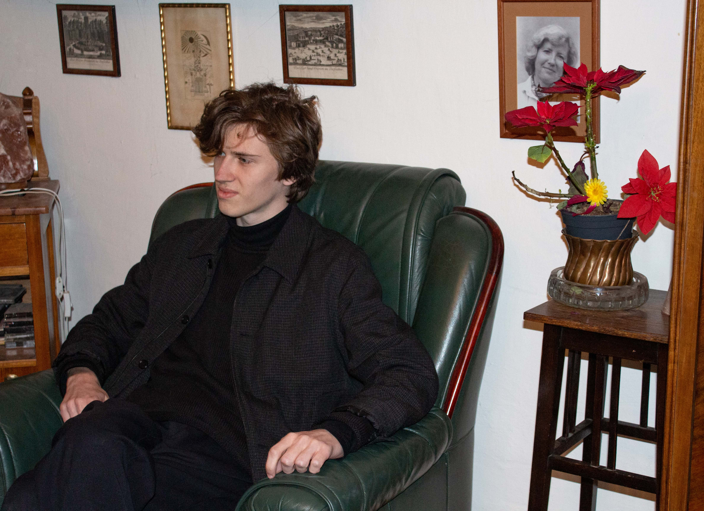

# Martin Strolený
[← Homepage](https://martinstroleny.github.io/english-for-designers/07-homepage/index)

## About Me

Hi, my name is Martin Strolený and I am a multidisciplinary designer based in the Czech Republic with a passion for well-crafted digital experiences.

- [View Selected Case Study](case-study.md)

## My Story

My goal is to connect people with brands and companies through design, a combination of strong concepts and refined execution.

I co-founded the software company Apparently Studio, where I currently work as a multidisciplinary designer. I'm always available for interesting collaborations and fun side projects. If you would like to cooperate, do not hesitate to contact me.

I am currently studying the final year of my bachelor's degree at University of Creative Communication in the field of Graphic and Media design.
