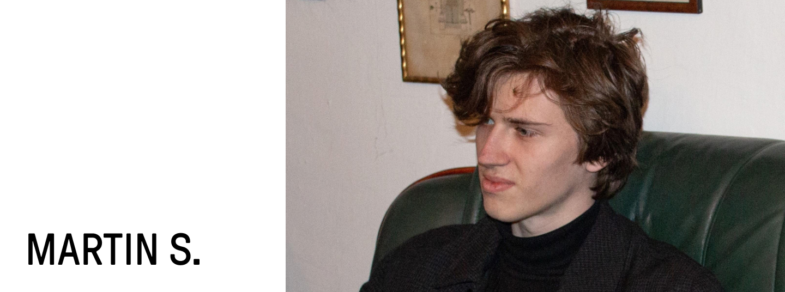

# Martin Strolený

### Contact
Visit me in the studio at [Za Žoskou 2506, Nymburk, 288 02](https://www.google.com/maps?q=apparently+studio&client=safari&rls=en&sxsrf=AOaemvLNtWmaKZ7lPGxbHurpA6-SCIn-kw:1641317686252&gs_lcp=Cgdnd3Mtd2l6EAMYADIHCCMQsQIQJzIECAAQQzIECAAQCjIECAAQCjIKCC4QxwEQrwEQCjIECC4QCjIECAAQCjIECAAQCjIECAAQCjIECAAQCjoHCCMQsAMQJzoECCMQJzoFCAAQkQI6CwguEMcBENEDEJECOgsILhCABBDHARDRAzoLCC4QgAQQxwEQowI6BQguEIAEOgUIABCABDoNCC4QgAQQxwEQ0QMQCjoHCC4QgAQQCjoLCC4QgAQQxwEQrwE6BwgAEIAEEAo6CwguEMcBEKMCEJECOgoILhDHARCjAhBDOgUIABDLAToHCAAQChDLAToLCC4QxwEQrwEQywE6BQguEMsBSgQIQRgBSgQIRhgAUO4GWJYiYIkraAhwAHgCgAHBAYgB7wuSAQQxMi40mAEAoAEByAECwAEB&um=1&ie=UTF-8&sa=X&ved=2ahUKEwjOr-e50pj1AhWMQvEDHTTzBL0Q_AUoA3oECAEQBQ) 
 
martin.stroleny@apparently.cz 
If you want to work with me on smaller design focused projects 
 
[apparently.studio](https://apparently.studio) 
If you have a larger project which requires software solution
## About
## Coursework
01 &nbsp;&nbsp;[Character & Description](https://martinstroleny.github.io/english-for-designers/01-character-description/index) 
02 &nbsp;&nbsp;[Impression](https://martinstroleny.github.io/english-for-designers/02-impression/index) 
03 &nbsp;&nbsp;[Case Study: Media](https://martinstroleny.github.io/english-for-designers/03-aboutness/index) 
04 &nbsp;&nbsp;Experience: CV 
05 &nbsp;&nbsp;Voice & Tone 
06 &nbsp;&nbsp;Storytelling 
## Takeaways
#### Substance over form
I should start with content, than add design elements which support it and give it more meaning and memorability.
#### Accessibility
Seek more accessibility in the way I design software solutions.
#### Voice, Tone and Style
Meaning and application of voice, tone and style in design systems. After the lesson I learned about this, I immediately used it in practice.
#### Commication skills
Thinking about how I communicate my thoughts, ideas and projects in both everyday and professional life.
#### Recognizing my mistakes
Awareness of mistakes in my speeches, presentations and in the overall communication of my projects in front of strangers, where I am afraid of every word and my own failure. I have to learn to trust my communication skills and constantly improve them. This applies to both my native and English language.
#### Thank you
It is possible to have a nice time in english lessons. Thank you Justin.
