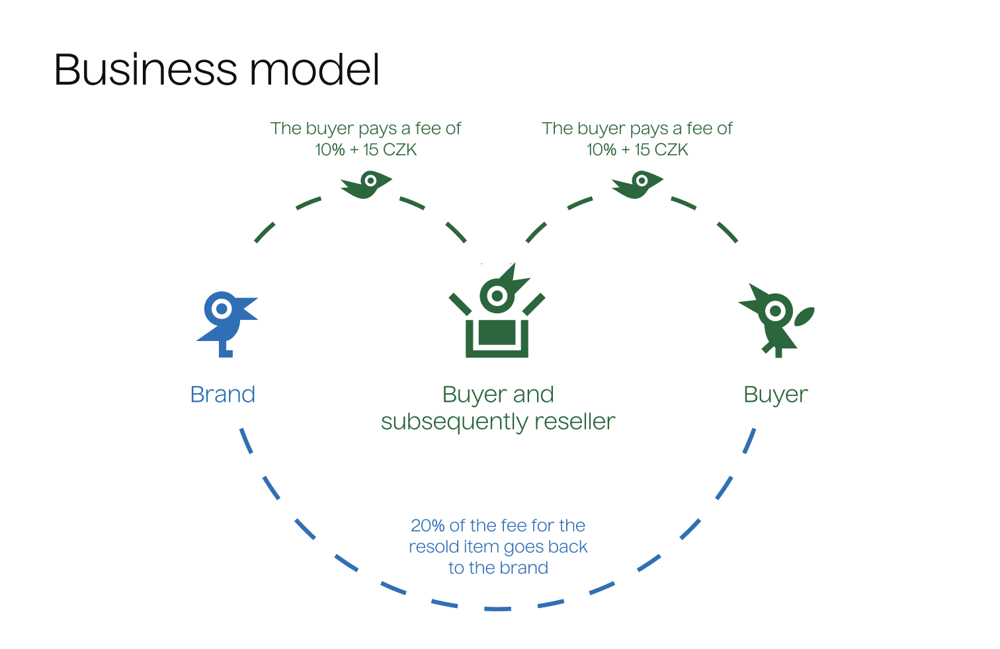

# Afterlife
To present the project, I created several of the following slides, which as a whole form pitchdeck. I also use similar slides in my bachelor thesis.
You can [open prototype](https://apparently.studio](https://www.figma.com/proto/FJZ6pTPnp5Fmd6ZNJuhmjd/Afterlife?page-id=22%3A4&node-id=684%3A31120&viewport=1266%2C168%2C0.02&scaling=scale-down&starting-point-node-id=714%3A25533&show-proto-sidebar=1) of this mobile application using Figma.

## Introduction

The first introductory slide presents the title and one of the key claims of Afterlife. I have been communicating from the very beginning that the service focuses on both designers and people who consume fashion or buy and resell it.

## Problem

The second slide describes the 3 key issues that give rise to this service.

## Solution

The third slide responds to the identified problems and communicates their solutions.

## Market

In the fourth slide, we will learn which market Afterlife is primarily targeting. I choose Europe because this is the platform that is most lacking here, as has already been mentioned in the problems, people sell clothes through Facebook groups and because Europe, such as Paris, is the heart of the fashion industry. Trends that continue to spread to America are mostly emerging in either Europe or Asia.

## Czech market

In the fifth slide, I show the number of people who use Facebook groups, I do not even count Instagram here. This is a fairly high number of 80,000, which is based on active members of these main groups.

## Product

In the sixth slide, however, I still describe the functions of the application in a very abstract way and show for the first time what the product is likely to look like after development.

## Business model

In the seventh slide, I show the first part of the business model, which distinguishes my service and gives part of the service's earnings back to the designers. By having their products resold, they can communicate and value sustainable fashion.

## Subscription

The business model also includes a subscription, which is divided into 3 pillars. In the first place, it will focus only on designers, or the creation of e-shops, but in the future, I plan to create subscribtion for resellers.

## Competition

The competition of the service is both services enabling the creation of your own e-shop and existing platforms focusing on the resale and direct sale of clothing.

## Competitive advantages

I close the presentation with a final slide, which summarizes the benefits and innovations of the service in two short claims.
